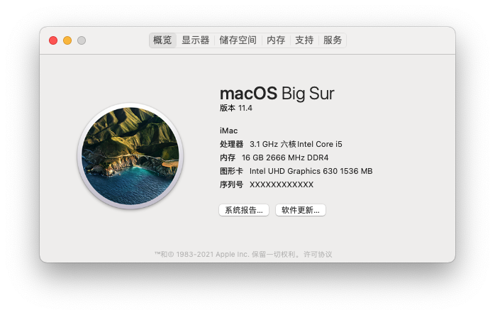
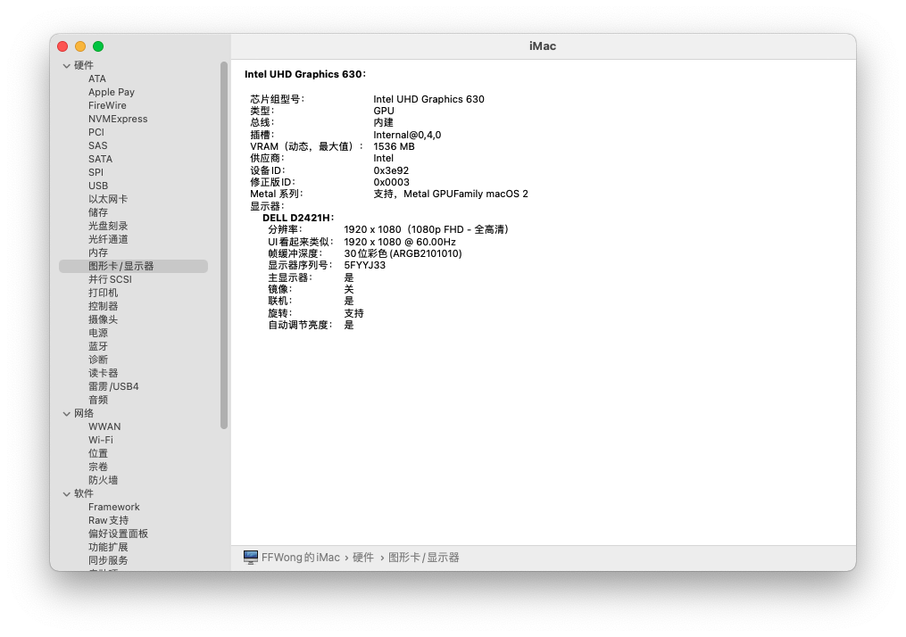
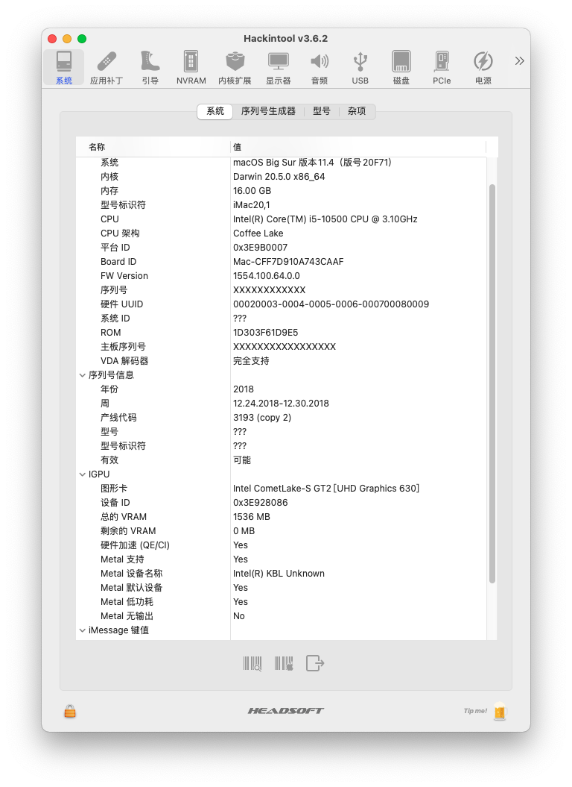

# Hackintosh-10500-B460M-AORUS-PRO
Hackintosh OpenCore EFI, i5 10500, GIGABYTE B460M AORUS PRO, iGPU UHD 630, BCM94360CD

亲测好用EFI

## BIOS设置

Bios版本推荐F3或F4

Advanced模式下的设置如下

1.Tweaker—>进阶处理器设置—>VT-d—>改为启动

2.Tweaker—>XMP—>改为配置1

3.Settings—>IO Ports—>内建显示绘图核心—>改为启动（使用核显的情况下，无核显则跳过该步骤）

4.Settings—>IO Ports—>4G以上解码—>单显卡改为关闭，多显卡改为启动

5.Settings—>IO Ports—>USB程序—>XHCI Hard-off—>改为开启

6.Boot—>CFG Lock—>改为关闭

7.Boot—>快速启动—>改为关闭（停用连接）

8.Boot—>Windows10功能—>改为其他操作系统

9.Boot—>CSM支持—>改为关闭

按F10保存并退出

## 电脑信息

| 部件 | 型号  |
|:----------|:----------|
| CPU      | INTEL i5-10500 |
| 主板      | 技嘉 GIGABYTE B460M AORUS PRO |
| 内存      | 三星 SAMSUNG DDR4 2666MHz 16GB |
| 显卡      | 集成显卡 iGPU UHD 630  |
| 储存      | 东芝 TOSHIBA HDD 1T |
| 网卡      | 主板集成  |
| 无线网卡   | 苹果免驱 Fenvi FV-T919 BCM94360CD |
| 系统      | MacOS big Sur 11.4   |

### 功能测试
- [x] USB端口（后面板USB都可用）

- [x] 核显正常

- [x] 声卡正常

- [x] 以太网正常

- [x] 蓝牙/WiFi正常

- [x] Airdrop/Handoff/iMessage 正常

  

## Tools 工具

系统安装完成后需要使用OpenCore Configurator或其他工具挂载EFI

- [OpenCore Configurator](https://www.macwk.com/soft/opencore-configurator)
- [Hackintool](https://github.com/headkaze/Hackintool/releases)

## 系统截图

